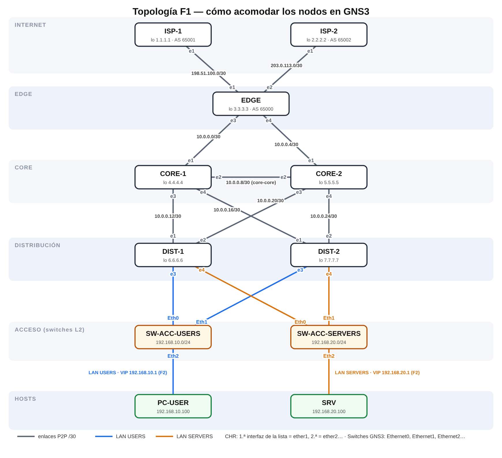
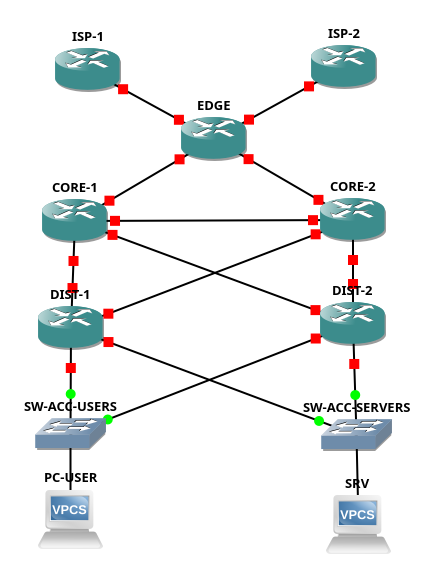
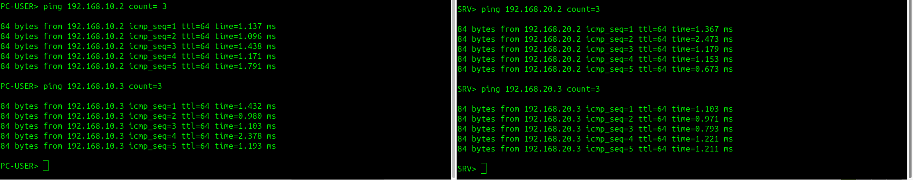

# memoria

# Memoria del Laboratorio — Failover Routing

**Grupo:** Grupo 6

**Materia:** Gestión Operativa y Seguridad en Redes (GOYS)

**Institución:** Universidad Tecnológica Nacional — Facultad Regional La Plata (UTN FR La Plata)

**Ciclo Lectivo:** 2026

**Fecha de entrega (F0):** 02/10/2026 · **Fecha de entrega (F1):** 09/10/2026 · **Fecha de entrega final:** 23/10/2026

## Integrantes y roles

| Integrante | Rol Principal | Rol Secundario / Soporte | Responsabilidades Principales |
| --- | --- | --- | --- |
| **Nicolás Valdés** | **R1** — Líder / Edge-WAN | — | Arquitectura eBGP borde, diseño de red, gestión de cambios y releases. |
| **Ivan Vijandi** | **R2** — Proveedores (ISPs) | **R5** — Operaciones / Backlog (Co-responsable) | Configuración de ISPs externos, peering BGP, change log y trazabilidad en git. |
| **Facundo Otero** | **R3** — Core | **R5** — QA / Verificación (Co-responsable) | OSPF Área 0, enlace core-core, métricas de enrutamiento y pruebas de convergencia. |
| **Franco Pietrantuono** | **R4** — Distribución | — | VRRP vrid 10/20, balanceo de carga (load-sharing), gateways de acceso L2. |

---

## 1. Diseño (F0)

### 1.1 Corrección del diagrama

A partir del análisis crítico de ingeniería sobre el diagrama de referencia *“Enterprise Network Design (Cisco)”* (difundido ampliamente en redes y literatura técnica comercial), se detectaron fallas estructurales graves de diseño que comprometen la alta disponibilidad, la predictibilidad del plano de control y la escalabilidad de la infraestructura.

A continuación se detallan los tres defectos primordiales detectados, las correcciones implementadas y sus justificaciones técnicas de ingeniería:

| # | Defecto detectado | Corrección aplicada | Justificación técnica de ingeniería |
| --- | --- | --- | --- |
| **1** | **Ausencia de enlace troncal Core–Core (`CORE-1 ↔︎ CORE-2`)**.Los routers de Core solo poseen enlaces ascendentes hacia el Edge y descendentes hacia Distribución, careciendo de interconexión directa entre sí. | Se diseñó e implementó un enlace punto a punto `/30` directo entre **`CORE-1` y `CORE-2`** integrado al Área 0 backbone de OSPF. | Si se corta el enlace `EDGE ↔︎ CORE-1`, en ausencia de enlace inter-core todo el tráfico proveniente de `DIST-1` hacia `CORE-1` queda en un agujero negro (*blackhole*) o se ve forzado a realizar un desvío subóptimo bajando nuevamente a la capa de distribución para alcanzar `CORE-2`. La interconexión directa en el Core garantiza continuidad del plano de control OSPF (evitando partición de área), provee un camino alternativo ultra-rápido de tránsito puro L3 y desacopla la resiliencia del Core respecto de las capas adyacentes. |
| **2** | **FHRP ubicado en el Core colapsado (*Collapsed Core*)**.El diagrama original sitúa los protocolos de redundancia de primer salto (HSRP) directamente en los routers de Core, extendiendo dominios de broadcast L2 hasta el núcleo de la red. | Se reubicó el mecanismo **FHRP (utilizando el estándar abierto VRRPv3 / RFC 5798)** en los routers de la **capa de Distribución (`DIST-1` y `DIST-2`)**, manteniendo al Core como una capa de **tránsito puro L3**. | El principio jerárquico de redes establece que la capa de Core debe dedicarse exclusivamente a la conmutación de paquetes de alta velocidad (*fast packet switching*), sin mantener estados de acceso ni procesar tráfico broadcast/multicast de hosts. La frontera L2/L3 y la terminación de gateways por defecto (SVIs y VRRP) pertenecen conceptualmente a la capa de Distribución. Asimismo, se adoptó VRRP en lugar del propietario HSRP para evitar el *vendor lock-in* y cumplir con estándares abiertos multi-vendor. |
| **3** | **Subredes solapadas y direccionamiento no jerárquico (*Overlapping*)**.El diagrama presenta duplicación de rangos IP en distintos bloques y omite el diseño de subredes dedicadas para enlaces punto a punto de tránsito. | Se diseñó un **plan IPAM estricto y normalizado**: todas las conexiones punto a punto entre routers son subredes `/30` exclusivas y no solapadas, mientras que las redes de hosts y servidores son segmentos `/24` independientes y sumarizables. | El solapamiento de subredes genera conflictos irreversibles en las tablas de enrutamiento dinámico (LSA tipo 1 y 2 en OSPF), envenenamiento de rutas y comportamiento errático en el reenvío de paquetes. Un esquema jerárquico riguroso con prefijos `/30` optimiza el uso del espacio de direcciones de tránsito, minimiza el tamaño de la tabla FIB y simplifica el troubleshooting y la seguridad perimetral. |

### 1.2 Plan de direccionamiento (IPAM)

El plan de direccionamiento IP se diseñó respetando el principio de **cero solapamiento (*zero overlapping*)**. Los enlaces de interconexión punto a punto se estructuran en subredes `/30` (2 direcciones de host útiles por enlace), mientras que los segmentos de usuarios y servidores se configuran en subredes `/24`.

#### Tabla de Enlaces Punto a Punto y Segmentos LAN

| Enlace / Red | Subred | Dispositivo A (IP / Interfaz) | Dispositivo B (IP / Interfaz) | Propósito / Tipo |
| --- | --- | --- | --- | --- |
| **ISP-1 ↔︎ EDGE** | `198.51.100.0/30` | `ISP-1`: `198.51.100.1/30` (`ether1` / `0/0`) | `EDGE`: `198.51.100.2/30` (`ether1` / `0/0`) | WAN Primaria (eBGP AS 65001) |
| **ISP-2 ↔︎ EDGE** | `203.0.113.0/30` | `ISP-2`: `203.0.113.1/30` (`ether1` / `0/0`) | `EDGE`: `203.0.113.2/30` (`ether2` / `1/0`) | WAN Backup (eBGP AS 65002) |
| **EDGE ↔︎ CORE-1** | `10.0.0.0/30` | `EDGE`: `10.0.0.1/30` (`ether3` / `2/0`) | `CORE-1`: `10.0.0.2/30` (`ether1` / `0/0`) | Tránsito Interior (OSPF Área 0) |
| **EDGE ↔︎ CORE-2** | `10.0.0.4/30` | `EDGE`: `10.0.0.5/30` (`ether4` / `3/0`) | `CORE-2`: `10.0.0.6/30` (`ether1` / `0/0`) | Tránsito Interior (OSPF Área 0) |
| **CORE-1 ↔︎ CORE-2** | `10.0.0.8/30` | `CORE-1`: `10.0.0.9/30` (`ether2` / `1/0`) | `CORE-2`: `10.0.0.10/30` (`ether2` / `1/0`) | Enlace Troncal Core-Core (OSPF) |
| **CORE-1 ↔︎ DIST-1** | `10.0.0.12/30` | `CORE-1`: `10.0.0.13/30` (`ether3` / `2/0`) | `DIST-1`: `10.0.0.14/30` (`ether1` / `0/0`) | Distribución Uplink 1 |
| **CORE-1 ↔︎ DIST-2** | `10.0.0.16/30` | `CORE-1`: `10.0.0.17/30` (`ether4` / `3/0`) | `DIST-2`: `10.0.0.18/30` (`ether1` / `0/0`) | Distribución Uplink 2 |
| **CORE-2 ↔︎ DIST-1** | `10.0.0.20/30` | `CORE-2`: `10.0.0.21/30` (`ether3` / `2/0`) | `DIST-1`: `10.0.0.22/30` (`ether2` / `1/0`) | Distribución Uplink 3 |
| **CORE-2 ↔︎ DIST-2** | `10.0.0.24/30` | `CORE-2`: `10.0.0.25/30` (`ether4` / `3/0`) | `DIST-2`: `10.0.0.26/30` (`ether2` / `1/0`) | Distribución Uplink 4 |
| **LAN USERS** | `192.168.10.0/24` | `DIST-1`: `192.168.10.2/24` (`ether3` / `2/0`)`DIST-2`: `192.168.10.3/24` (`ether3` / `2/0`) | `SW-ACC-USERS` ➔ `PC-USER`: `192.168.10.100/24`GW: `192.168.10.1` | Segmento Usuarios (VRRP vrid 10) |
| **LAN SERVERS** | `192.168.20.0/24` | `DIST-1`: `192.168.20.2/24` (`ether4` / `3/0`)`DIST-2`: `192.168.20.3/24` (`ether4` / `3/0`) | `SW-ACC-SERVERS` ➔ `SRV`: `192.168.20.100/24`GW: `192.168.20.1` | Segmento Servidores (VRRP vrid 20) |

#### Parametrización de Grupos VRRP (Load-Sharing Activo/Activo)

Para evitar la subutilización de equipamiento con un esquema activo/pasivo puro, se define un esquema de **balanceo de carga por grupo (*load-sharing*)**: `DIST-1` es el Master primario para la red de Usuarios, mientras que `DIST-2` asume el rol de Master primario para la red de Servidores.

| Grupo | VRID | Interfaz Base | Router Master | Prioridad Master | Router Backup | Prioridad Backup | IP Virtual (VIP) | Preemption | Timer |
| --- | --- | --- | --- | --- | --- | --- | --- | --- | --- |
| **USERS** | `10` | `ether3` | `DIST-1` | `150` | `DIST-2` | `100` | `192.168.10.1/24` | Habilitado | 1 seg |
| **SERVERS** | `20` | `ether4` | `DIST-2` | `150` | `DIST-1` | `100` | `192.168.20.1/24` | Habilitado | 1 seg |
- **MAC Virtual resultante (RFC 5798):**
    - Grupo USERS: `00:00:5E:00:01:0A` (Hex `0A` = Decimal 10)
    - Grupo SERVERS: `00:00:5E:00:01:14` (Hex `14` = Decimal 20)

#### Identificadores de Enrutador (Router-IDs) y Loopbacks

Cada router posee una dirección IP fija en su interfaz de Loopback (`lo0` / `bridge-loopback`), la cual actúa como **Router-ID canónico** para los procesos de OSPF y BGP, garantizando estabilidad absoluta ante caídas de interfaces físicas:

| Dispositivo | Rol en la Topología | Dirección Loopback / Router-ID | Sistema Autónomo (AS) |
| --- | --- | --- | --- |
| **ISP-1** | Proveedor de Tránsito 1 | `1.1.1.1/32` | AS 65001 |
| **ISP-2** | Proveedor de Tránsito 2 | `2.2.2.2/32` | AS 65002 |
| **EDGE** | Router de Borde Multi-homed | `3.3.3.3/32` | AS 65000 |
| **CORE-1** | Tránsito Backbone OSPF 1 | `4.4.4.4/32` | — (OSPF Área 0) |
| **CORE-2** | Tránsito Backbone OSPF 2 | `5.5.5.5/32` | — (OSPF Área 0) |
| **DIST-1** | Distribución / Gateway VRID 10 | `6.6.6.6/32` | — (OSPF Área 0) |
| **DIST-2** | Distribución / Gateway VRID 20 | `7.7.7.7/32` | — (OSPF Área 0) |

### 1.3 Política de seguridad

La seguridad del entorno se diseñó siguiendo el principio de **defensa en profundidad** y **mínimo privilegio operativo**, abarcando control de acceso administrativo, reducción de la superficie de ataque del sistema operativo de red y autenticación criptográfica en los planos de control:

#### 1. Usuarios, Autenticación y Privilegios (RBAC)

- **Remoción de la credencial por defecto (aplicado en F1):** el usuario `admin` deja de tener contraseña vacía y se le asigna una contraseña robusta en los 7 MikroTik CHR (`/user set admin password=...`), tal como lo establece la tarea de hardening de F1 del backlog.
- **Nota de implementación:** en F0 se contemplaba además crear un administrador nominal (`admin_goys`) y deshabilitar `admin`; en F1 se adoptó el cambio de contraseña de `admin` por simplicidad operativa, y el administrador nominal queda documentado como mejora posible.
- **Usuario de Telemetría y Auditoría (`monitor`):** Se crea el usuario `monitor` asignado estrictamente al grupo predefinido `read`. Este usuario tiene acceso exclusivo de lectura para inspección de tablas de enrutamiento, contadores y recolección de métricas, imposibilitando cualquier alteración no autorizada de la configuración:
    
    ```
    /user add name=monitor group=read password="MonitorGoys2026!#ReadOnly" comment="Usuario minimo para auditoria y telemetria"
    ```
    

#### 2. Reducción de Superficie de Ataque (Servicios Innecesarios)

Por defecto, RouterOS habilita múltiples servicios de gestión en texto claro o con protocolos inseguros. En los 7 nodos CHR se aplica una política restrictiva que **apaga taxativamente todos los servicios no esenciales**:

- **Deshabilitados:** `telnet` (puerto 23 TCP - texto plano), `ftp` (puerto 21 TCP - texto plano), `www` (puerto 80 TCP - HTTP inseguro), `api` (puerto 8728 TCP), `api-ssl` (puerto 8729 TCP).
- **Habilitados controlados:** `ssh` (puerto 22 TCP) con cifrado fuerte para administración remota, y consola serie/local para contingencias en GNS3.
- **Descubrimiento y Protocolos L2:** Se desactiva el servicio de descubrimiento MikroTik Neighbor Discovery Protocol (MNDP/CDP) y MAC-Winbox en las interfaces públicas/WAN conectadas hacia los ISPs:
    
    ```
    /ip service disable telnet,ftp,www,api,api-ssl
    /ip neighbor discovery-settings set discover-interface-list=none
    ```
    

#### 3. Autenticación Criptográfica en Protocolos de Enrutamiento

Para evitar inyección de rutas falsas, envenenamiento de tablas (*route poisoning*) y ataques de denegación de servicio (*DoS*) sobre el plano de control:

- **OSPFv2 (Área 0 Backbone):** Autenticación criptográfica obligatoria mediante **MD5** en todas las interfaces de tránsito (`CORE-1`, `CORE-2`, `EDGE`, `DIST-1`, `DIST-2`). Clave de autenticación: `Goys2026OspfPass`.
- **eBGP (Borde Multi-homing):** Autenticación **TCP-MD5 (RFC 2385)** configurada en las sesiones BGP entre `EDGE` y los proveedores `ISP-1` e `ISP-2`, protegiendo el intercambio de prefijos contra ataques de RST/spoofing. Clave de peering: `BgpSecret2026Edge`.
- **VRRP (Capa de Distribución):** Autenticación por contraseña en ambos grupos virtuales (`vrid 10` y `vrid 20`), evitando que un host malicioso conectado en la capa de acceso L2 declare una prioridad superior y secuestre el gateway (*gateway spoofing*). Claves de grupo: `VrrpPass10` y `VrrpPass20`.

### 1.4 Política de operación

#### 1. Formato del Change Log y Convención de Commits

Para garantizar auditoría, trazabilidad y reproducibilidad del estado de la red, todos los cambios en las configuraciones, documentación y scripts deben registrarse en el repositorio Git bajo el estándar **Conventional Commits v1.0.0**:

$$
\text{Formato: } \texttt{<tipo>(<alcance>): <descripción concisa en imperativo>}
$$

- **Tipos de commit autorizados:**
    - `feat`: Nueva funcionalidad de red (ej. levantar VRRP, configurar sesión BGP).
    - `fix`: Corrección de un fallo o desvío en configuración/enrutamiento.
    - `docs`: Modificaciones exclusivamente en documentación (`README.md`, `memoria.md`, diagramas).
    - `ops`: Tareas de operación, backups, exportación de configuraciones o ejecución de drills.
    - `chore`: Tareas de mantenimiento general del repositorio, orden de archivos o ajustes menores.
- **Alcances (*scopes*) válidos:** `isp1`, `isp2`, `edge`, `core1`, `core2`, `dist1`, `dist2`, `vrrp`, `ospf`, `bgp`, `security`, `ipam`.
- **Ejemplos:**
    - `feat(vrrp): configurar grupos 10 y 20 con load sharing en dist1 y dist2`
    - `ops(backup): registrar snapshot de configuraciones exportadas para hito F1`
    - `fix(ospf): corregir mascara en enlace core1-core2 para levantar adyacencia full`

Cada modificación significativa debe replicarse en la tabla del **Change Log (Sección 6.1)** indicando responsable, motivo de ingeniería y procedimiento explícito de reversión (*rollback*).

#### 2. Política de Backup y Recuperación ante Desastres (DR)

La política de respaldo se fundamenta en dos mecanismos complementarios provistos por RouterOS:

1. **Respaldo Textual Portable (`/export`):**
    - Comando: `/export verbose=no file=configs/<nodo>_f<X>_export`
    - Características: Script legible en texto plano (.rsc), auditable línea por línea mediante `git diff`, modificable y agnóstico al hardware físico o versión de firmware. Se versiona directamente en el repositorio Git dentro del directorio `configs/`.
2. **Respaldo Binario de Estado Completo (`/system backup`):**
    - Comando: `/system backup save name=backups/<nodo>_f<X>_full`
    - Características: Imagen binaria comprimida (.backup) que incluye configuraciones, llaves criptográficas, usuarios y hashes del sistema. Se almacena en la carpeta `backups/`.

**Frecuencia y Ocasiones de Respaldo:**

- **Pre-Change:** Antes de aplicar cualquier cambio de configuración en sesiones BGP, áreas OSPF o interfaces troncales.
- **Post-Change:** Inmediatamente después de verificar que un cambio fue exitoso y validado mediante telemetría.
- **Cierre de Fase (Milestones):** Backup formal consolidado de los 7 routers al finalizar cada fase (`F0`, `F1`, `F2`, `F3`, `F4`, `F5`).
- **Prueba de Restauración (*Restore Drill*):** Al finalizar la Fase F1, se realizará una prueba destructiva controlada en un nodo (`DIST-1`), reseteando la configuración de fábrica (`/system reset-configuration`) y restaurando el servicio íntegramente desde el backup para certificar el RTO (*Recovery Time Objective*).

---

## 2. Topología



*Figura 1 — Diagrama de diseño con interfaces y subredes por enlace.*



*Figura 2 — Captura del proyecto en GNS3 (7 CHR + 2 switches + 2 hosts).*

- Cada switch de acceso se conecta a **ambos** routers de distribución (`DIST-1` y `DIST-2`): requisito para que VRRP (F2) pueda operar sobre un mismo segmento L2.
- Cableado verificado con `/ip neighbor print` antes de aplicar el hardening (evidencia: `capturas/f1/02_neighbors_core1.png`).

---

## 3. Configuración

> Un bloque por dispositivo. Se puede referenciar el archivo `.rsc` del repo y pegar el contenido final.
> 

### 3.1 ISP-1

```
# Script de configuracion para ISP-1 (configs/isp1.rsc) - Fase F1
# FASE 1
# 2026-10-08 07:57:14 by RouterOS 7.16
# software id = 
#
/interface bridge
add name=lo0
/interface ethernet
set [ find default-name=ether1 ] disable-running-check=no
set [ find default-name=ether2 ] disable-running-check=no
set [ find default-name=ether3 ] disable-running-check=no
set [ find default-name=ether4 ] disable-running-check=no
/port
set 0 name=serial0
/ip neighbor discovery-settings
set discover-interface-list=none
/ip address
add address=1.1.1.1 interface=lo0 network=1.1.1.1
add address=198.51.100.1/30 interface=ether1 network=198.51.100.0
/ip dhcp-client
add interface=ether1
/ip service
set telnet disabled=yes
set ftp disabled=yes
set www disabled=yes
set api disabled=yes
set api-ssl disabled=yes
/system identity
set name=ISP-1
/system note
set show-at-login=no

```

### 3.2 ISP-2

```
# Script de configuracion para ISP-2 (configs/isp2.rsc) - Fase F1/F3
# FASE 1
# 2026-10-08 07:57:17 by RouterOS 7.16
# software id = 
#
/interface bridge
add name=lo0
/interface ethernet
set [ find default-name=ether1 ] disable-running-check=no
set [ find default-name=ether2 ] disable-running-check=no
set [ find default-name=ether3 ] disable-running-check=no
set [ find default-name=ether4 ] disable-running-check=no
/port
set 0 name=serial0
/ip neighbor discovery-settings
set discover-interface-list=none
/ip address
add address=2.2.2.2 interface=lo0 network=2.2.2.2
add address=203.0.113.1/30 interface=ether1 network=203.0.113.0
/ip dhcp-client
add interface=ether1
/ip service
set telnet disabled=yes
set ftp disabled=yes
set www disabled=yes
set api disabled=yes
set api-ssl disabled=yes
/system identity
set name=ISP-2
/system note
set show-at-login=no

```

### 3.3 EDGE

```
# Script de configuracion para EDGE (configs/edge.rsc) - Fase F1/F3
# FASE 1
# 2026-10-08 07:57:12 by RouterOS 7.16
# software id = 
#
/interface bridge
add name=lo0
/interface ethernet
set [ find default-name=ether1 ] disable-running-check=no
set [ find default-name=ether2 ] disable-running-check=no
set [ find default-name=ether3 ] disable-running-check=no
set [ find default-name=ether4 ] disable-running-check=no
/port
set 0 name=serial0
/ip neighbor discovery-settings
set discover-interface-list=none
/ip address
add address=3.3.3.3 interface=lo0 network=3.3.3.3
add address=198.51.100.2/30 interface=ether1 network=198.51.100.0
add address=203.0.113.2/30 interface=ether2 network=203.0.113.0
add address=10.0.0.1/30 interface=ether3 network=10.0.0.0
add address=10.0.0.5/30 interface=ether4 network=10.0.0.4
/ip dhcp-client
add interface=ether1
/ip service
set telnet disabled=yes
set ftp disabled=yes
set www disabled=yes
set api disabled=yes
set api-ssl disabled=yes
/system identity
set name=EDGE
/system note
set show-at-login=no

```

### 3.4 CORE-1

```
# Script de configuracion para CORE-1 (configs/core1.rsc) - Fase F1/F2
# FASE 1
# 2026-10-08 07:56:41 by RouterOS 7.16
# software id = 
#
/interface bridge
add name=lo0
/interface ethernet
set [ find default-name=ether1 ] disable-running-check=no
set [ find default-name=ether2 ] disable-running-check=no
set [ find default-name=ether3 ] disable-running-check=no
set [ find default-name=ether4 ] disable-running-check=no
/port
set 0 name=serial0
/ip neighbor discovery-settings
set discover-interface-list=none
/ip address
add address=4.4.4.4 interface=lo0 network=4.4.4.4
add address=10.0.0.2/30 interface=ether1 network=10.0.0.0
add address=10.0.0.9/30 interface=ether2 network=10.0.0.8
add address=10.0.0.13/30 interface=ether3 network=10.0.0.12
add address=10.0.0.17/30 interface=ether4 network=10.0.0.16
/ip dhcp-client
add interface=ether1
/ip service
set telnet disabled=yes
set ftp disabled=yes
set www disabled=yes
set api disabled=yes
set api-ssl disabled=yes
/system identity
set name=CORE-1
/system note
set show-at-login=no

```

### 3.5 CORE-2

```
# Script de configuracion para CORE-2 (configs/core2.rsc) - Fase F1/F2
# FASE 1
# 2026-10-08 07:57:08 by RouterOS 7.16
# software id = 
#
/interface bridge
add name=lo0
/interface ethernet
set [ find default-name=ether1 ] disable-running-check=no
set [ find default-name=ether2 ] disable-running-check=no
set [ find default-name=ether3 ] disable-running-check=no
set [ find default-name=ether4 ] disable-running-check=no
/port
set 0 name=serial0
/ip neighbor discovery-settings
set discover-interface-list=none
/ip address
add address=5.5.5.5 interface=lo0 network=5.5.5.5
add address=10.0.0.6/30 interface=ether1 network=10.0.0.4
add address=10.0.0.10/30 interface=ether2 network=10.0.0.8
add address=10.0.0.21/30 interface=ether3 network=10.0.0.20
add address=10.0.0.25/30 interface=ether4 network=10.0.0.24
/ip dhcp-client
add interface=ether1
/ip service
set telnet disabled=yes
set ftp disabled=yes
set www disabled=yes
set api disabled=yes
set api-ssl disabled=yes
/system identity
set name=CORE-2
/system note
set show-at-login=no
```

### 3.6 DIST-1

```
# Script de configuracion para DIST-1 (configs/dist1.rsc) - Fase F1/F2
# FASE 1
# 2026-10-08 07:51:19 by RouterOS 7.16
# software id = 
#
/interface bridge
add name=lo0
/interface ethernet
set [ find default-name=ether1 ] disable-running-check=no
set [ find default-name=ether2 ] disable-running-check=no
set [ find default-name=ether3 ] disable-running-check=no
set [ find default-name=ether4 ] disable-running-check=no
/port
set 0 name=serial0
/ip neighbor discovery-settings
set discover-interface-list=none
/ip address
add address=6.6.6.6 interface=lo0 network=6.6.6.6
add address=10.0.0.14/30 interface=ether1 network=10.0.0.12
add address=10.0.0.22/30 interface=ether2 network=10.0.0.20
add address=192.168.10.2/24 interface=ether3 network=192.168.10.0
add address=192.168.20.2/24 interface=ether4 network=192.168.20.0
/ip dhcp-client
add interface=ether1
/ip service
set telnet disabled=yes
set ftp disabled=yes
set www disabled=yes
set api disabled=yes
set api-ssl disabled=yes
/system identity
set name=DIST-1
/system note
set show-at-login=no
```

### 3.7 DIST-2

```
# Script de configuracion para DIST-2 (configs/dist2.rsc) - Fase F1/F2
#FASE 1
# 2026-10-08 07:56:16 by RouterOS 7.16
# software id = 
#
/interface bridge
add name=lo0
/interface ethernet
set [ find default-name=ether1 ] disable-running-check=no
set [ find default-name=ether2 ] disable-running-check=no
set [ find default-name=ether3 ] disable-running-check=no
set [ find default-name=ether4 ] disable-running-check=no
/port
set 0 name=serial0
/ip neighbor discovery-settings
set discover-interface-list=none
/ip address
add address=7.7.7.7 interface=lo0 network=7.7.7.7
add address=10.0.0.18/30 interface=ether1 network=10.0.0.16
add address=10.0.0.26/30 interface=ether2 network=10.0.0.24
add address=192.168.10.3/24 interface=ether3 network=192.168.10.0
add address=192.168.20.3/24 interface=ether4 network=192.168.20.0
/ip dhcp-client
add interface=ether1
/ip service
set telnet disabled=yes
set ftp disabled=yes
set www disabled=yes
set api disabled=yes
set api-ssl disabled=yes
/system identity
set name=DIST-2
/system note
set show-at-login=no

```

### 3.8 Hosts (PC-USER / SRV)

```bash
# PC-USER (VPCS)
ip 192.168.10.100/24 192.168.10.1
save

# SRV (VPCS)
ip 192.168.20.100/24 192.168.20.1
save
```

---

## 4. Verificación

### 4.1 Conectividad básica

> Las pruebas de la primera tabla corresponden a F2/F3 (requieren VRRP, OSPF y BGP). La verificación de F1 está en la tabla siguiente.

| Prueba | Comando | Resultado esperado |
| --- | --- | --- |
| ping intra-LAN (PC-USER ↔︎ SRV) | `ping 192.168.20.100` | Comunicación exitosa inter-VLAN vía gateway VRRP |
| traceroute a ISP (loopback) | `traceroute 1.1.1.1` | Salida resuelta vía camino primario EDGE ↔︎ ISP-1 |

> En las fases siguientes se pegarán capturas de las tablas: `/routing/route/print`, `/interface/vrrp/print`, `/routing/bgp/session/print`.
> 

#### Verificación F1 — conectividad punto a punto

| Origen | Destino | Resultado | Evidencia |
| --- | --- | --- | --- |
| `EDGE` | `198.51.100.1` (ISP-1), `203.0.113.1` (ISP-2), `10.0.0.2` (CORE-1), `10.0.0.6` (CORE-2) | 100 % de respuesta | `capturas/f1/03_pings_edge.png` |
| `CORE-1` | `10.0.0.10` (CORE-2, enlace core-core), `10.0.0.14` (DIST-1), `10.0.0.18` (DIST-2) | 100 % de respuesta | `capturas/f1/04_pings_core1.png` |
| `PC-USER` / `SRV` | IP real de `DIST-1` y `DIST-2` en su LAN | 100 % de respuesta | `capturas/f1/05_pings_hosts.png` |



*Figura 3 — Conectividad de los hosts hacia las IP reales de los routers de distribución.*

Los hosts aún no alcanzan la IP virtual (`192.168.10.1` / `192.168.20.1`): VRRP se configura en F2.
Snapshot `BASE` generado con la red cableada y el direccionamiento verificado (`capturas/f1/06_snapshot_base.png`).

### 4.2 Los 5 drills de failover

> Para cada drill, documentar con la estructura **detección → respuesta → recuperación → post-mortem** y el **tiempo medido**.
> 

#### Drill 1 — VRRP: se cae el gateway

- **Detección:**
- **Respuesta:**
- **Recuperación:**
- **Tiempo medido:**
- **Post-mortem:**

#### Drill 2 — OSPF: se corta el camino interno

- **Detección:**
- **Respuesta:**
- **Recuperación:**
- **Tiempo medido:**
- **Post-mortem:**

#### Drill 3 — BGP: se cae el proveedor

- **Detección:**
- **Respuesta:**
- **Recuperación:**
- **Tiempo medido:**
- **Post-mortem:**

#### Drill 4 — check-gateway: failover estático de enlace

- **Detección:**
- **Respuesta:**
- **Recuperación:**
- **Tiempo medido:**
- **Post-mortem:**

#### Drill 5 — Load-sharing VRRP: ambos DIST activos

- **Detección:**
- **Respuesta:**
- **Recuperación:**
- **Post-mortem:**

---

## 5. Seguridad aplicada

| Mecanismo | Dónde se aplicó | Verificación (¿cómo probaron que funciona?) |
| --- | --- | --- |
| Hardening (usuarios/servicios) | Los 7 routers CHR | Escaneo de puertos y prueba de acceso con usuario `monitor` (read-only) |
| OSPF MD5 | Área 0 (`EDGE`, `CORE-1`, `CORE-2`, `DIST-1`, `DIST-2`) | Caída deliberada de adyacencia al configurar clave incorrecta |
| BGP TCP-MD5 | Sesiones eBGP (`EDGE ↔︎ ISP-1`, `EDGE ↔︎ ISP-2`) | Rechazo de establecimiento de sesión TCP con clave inválida |
| VRRP auth | Grupos 10 y 20 en `DIST-1` y `DIST-2` | Rechazo de paquetes de anuncio VRRP espurios |
| Firewall/ACL (edge) | Router `EDGE` (interfaz WAN) | Bloqueo efectivo de paquetes no solicitados en la cadena input |

**Estado F1:** hardening aplicado en los 7 routers (contraseña de `admin`, usuario `monitor` de solo lectura, servicios `telnet`, `ftp`, `www`, `api` y `api-ssl` deshabilitados, descubrimiento de vecinos desactivado).

- Servicios deshabilitados: `capturas/f1/07_services_core1.png`.
- Prueba de mínimo privilegio con `monitor` (el cambio de configuración es rechazado): `capturas/f1/08_monitor_sin_permisos.png`.
- Sondeo de puertos inseguros entre routers vecinos (conexión rechazada): `capturas/f1/09_sondeo_servicios.png`.
- OSPF MD5, BGP TCP-MD5, VRRP auth y firewall edge corresponden a F2/F3.

---

## 6. Gestión operativa

### 6.1 Change log

| Fecha | Responsable | Cambio | Motivo | Cómo se revierte |
| --- | --- | --- | --- | --- |
| 02/10/2026 | [R1] Nicolás Valdés | `docs(f0): diseno inicial y definicion de politicas` | Cumplimiento del hito F0 de la cátedra GOYS | `git checkout <commit_previo>` |
| 02/10/2026 | [R5] Ivan / Facundo | `docs(ipam): aprobacion de plan de direccionamiento y roles` | Establecer bases de direccionamiento sin solapamiento | Revertir commit de IPAM |
| 08/10/2026 | [R3] Facundo Otero | `feat(core): direccionamiento base, core-core y hardening en core1 y core2` | Hito F1 | `git revert <hash>` o snapshot `BASE` (previo al hardening) |
| 08/10/2026 | [R3] Facundo Otero (en reemplazo de [R1] Nicolás Valdés, de viaje) | `feat(edge): direccionamiento wan, core y hardening en edge` | Hito F1; sesión compartida | `git revert <hash>` o snapshot `BASE` |
| 08/10/2026 | [R2] Ivan Vijandi | `feat(isp): direccionamiento base y hardening en isp1 e isp2` | Hito F1 | `git revert <hash>` o snapshot `BASE` |
| 08/10/2026 | [R4] Franco Pietrantuono | `feat(dist): direccionamiento base y hardening en dist1 y dist2` | Hito F1 | `git revert <hash>` o snapshot `BASE` |
| 08/10/2026 | [R5] Facundo Otero | `ops(backup): export inicial f1 de los 7 routers y evidencias` | Política de backup (sección 1.4) | Eliminar los archivos del commit |
| 08/10/2026 | [R5] Ivan Vijandi | `docs(f1): cierre de hito f1 topologia hardening y backup` | Cierre del hito F1 (backlog, change log, memoria) | `git revert <hash>` |

### 6.2 Backups

**Backup inicial (cierre de F1):** en cada uno de los 7 routers se ejecutó `/export verbose=no file=<nodo>` (script `.rsc`, auditable con `git diff`) y `/system backup save name=<NODO>_f1` (imagen binaria `.backup`).

- Los exports de texto están versionados en `configs/<nodo>.rsc` y `backups/<nodo>_f1_export.rsc`.
- Evidencia de la creación de los archivos en cada router: `capturas/f1/10_backups_file_print.png` (`/file print`).
- Los archivos `.backup` permanecen en el disco de cada CHR (proyecto GNS3 `goys-f1`), ya que la topología no dispone de una red de gestión hacia el equipo anfitrión.
- **Restore probado:** DIST-1 restaurado desde `DIST-1_f1.backup` con un **RTO de 3 min 9,58 s** (detalle a continuación; evidencia en `capturas/f1/11_restore_dist1.png`).

### Prueba de restauración (Restore Drill) — DIST-1

**Objetivo.** Validar que la configuración de un router de la capa de distribución puede recuperarse íntegramente a partir del respaldo binario generado durante el Hito F1, y medir el tiempo de recuperación (RTO).

**Alcance.** Se seleccionó `DIST-1` por ser el router que concentra las interfaces hacia ambos núcleos y hacia ambos segmentos de acceso (USERS y SERVERS). La prueba no afectó al resto de los nodos.

**Precondiciones.**

- Respaldo `DIST-1_f1.backup` generado con `/system backup save` luego de aplicar el direccionamiento y el hardening.
- Exportación de texto de la configuración (`dist1.rsc`) versionada en el repositorio como plan alternativo.

**Procedimiento.**

**1.** Se inició la medición manual del tiempo con un cronómetro.

**2.** Se eliminó la configuración del equipo:

```
/system reset-configuration no-defaults=yes skip-backup=yes
```

**3.** Tras el reinicio, se accedió por consola con el usuario `admin` sin contraseña (estado de fábrica).

**4.** Se restauró el respaldo:

```
/system backup load name=DIST-1_f1
```

**5.** Tras el segundo reinicio, se ingresó con las credenciales definidas en el hardening y se verificó el estado con:

```
/ip address print
/user print
```

**Resultado.** La configuración se recuperó por completo (direccionamiento de `ether1` a `ether4`, loopback `lo0` y usuarios `admin` y `monitor`). El tiempo total de recuperación (RTO) medido fue de **3 minutos 9,58 segundos**.

**Evidencia.** `capturas/f1/11_restore_dist1.png`.

**Análisis.**

- El RTO medido incluye dos reinicios del equipo (borrado y restauración) y las intervenciones manuales en consola (inicio de sesión, verificación del archivo y confirmaciones), por lo que constituye una cota superior para una recuperación realizada por un operador entrenado.
- El punto de recuperación (RPO) queda determinado por el momento en que se generó el último respaldo: cualquier cambio posterior a `DIST-1_f1.backup` no se restaura y debe reaplicarse desde el historial de commits del repositorio.
- El archivo `.backup` reside en el almacenamiento del propio CHR. Ante la pérdida del nodo completo, el plan alternativo es reaplicar el export `dist1.rsc` desde el repositorio y recrear los usuarios y contraseñas del hardening, ya que `/export` no los incluye.

**Conclusión.** El procedimiento de restauración resultó efectivo y reproducible, y valida la política de respaldos definida en el Hito F1. Se recomienda repetir la medición en las fases siguientes, con OSPF y VRRP operativos, para evaluar el tiempo de reconvergencia adicional.

### 6.3 Monitoreo

> Monitoreo de enlaces, adyacencias OSPF, sesiones BGP y estados VRRP mediante SNMP y scripts de telemetría (se consolidará en F4).
> 

---

## 7. Capturas

> Listar o enlazar la carpeta de capturas de la fase correspondiente (drills, tablas, failover).
> 
- `capturas/f0_aprobacion_diseno.png` (en preparación)
- `capturas/f1/01_topologia_gns3.png` — topología desplegada en GNS3
- `capturas/f1/02_neighbors_core1.png` — verificación de cableado (`/ip neighbor print`)
- `capturas/f1/03_pings_edge.png`, `04_pings_core1.png`, `05_pings_hosts.png` — conectividad punto a punto
- `capturas/f1/06_snapshot_base.png` — snapshot `BASE`
- `capturas/f1/07_services_core1.png`, `08_monitor_sin_permisos.png`, `09_sondeo_servicios.png` — hardening
- `capturas/f1/10_backups_file_print.png`, `11_restore_dist1.png` — backups y restore

---

## 8. Conclusiones y lecciones aprendidas

> Post-mortem global de la fase de diseño (F0):
> 
- La identificación temprana de las fallas del diagrama de referencia evidenció que la alta disponibilidad no es una propiedad emergente sino una disciplina de diseño deliberado.
- El desacoplamiento entre capas (Core como tránsito y Distribución como gateway) reduce drásticamente el radio de impacto (*blast radius*) de cualquier falla operativa.

> Post-mortem de la fase F1 (topología, hardening y backup):
> 
- **Dimensionamiento:** con 256 MB de RAM el CHR 7.16 no completó el arranque en el entorno de laboratorio (virtualización anidada: VirtualBox → Ubuntu → GNS3/QEMU) y se reiniciaba en bucle; con **384 MB** arrancó correctamente. Los 7 nodos requieren ~2,7 GB de RAM.
- **Cableado:** conviene verificar la matriz de interfaces con `/ip neighbor print` **antes** de aplicar el hardening, que deshabilita el descubrimiento de vecinos.
- **Backups:** el export de texto es la evidencia auditable; el `.backup` binario incluye usuarios y claves, pero no es extraíble del CHR sin una red de gestión.
- **Limitación a considerar en F4:** los tiempos de convergencia de los drills se miden sobre virtualización anidada y deben interpretarse con esa salvedad.

---

## 9. Referencias

- RFC 2281 — Cisco Hot Standby Router Protocol (HSRP).
- RFC 5798 — Virtual Router Redundancy Protocol (VRRP) Version 3 for IPv4 and IPv6.
- RFC 2328 — OSPF Version 2 (STD 54).
- RFC 2385 — Protection of BGP Sessions via the TCP MD5 Signature Option.
- RFC 4271 — A Border Gateway Protocol 4 (BGP-4).
- Halabi, Sam. (2000). *Internet Routing Architectures*, 2nd Edition. Cisco Press.
- Doyle, Jeff & Carroll, Jennifer. (2005). *Routing TCP/IP, Volume I*, 2nd Edition. Cisco Press.
- MikroTik RouterOS v7 Documentation — Routing (VRRP, OSPF, BGP) & System Management.

---

## 10. Checklist de entrega

### Diseño (F0)

- [x]  IPAM completo y sin solapamiento
- [x]  Corrección del diagrama justificada (≥ 3 defectos)
- [x]  Política de seguridad definida (usuarios, servicios, claves)
- [x]  Política de operación definida (change log + backup)

### Redes

- [x]  7 CHR + 2 switches + 2 hosts levantados y cableados
- [ ]  VRRP operativo (2 grupos, load-sharing)
- [ ]  OSPF área 0 con adyacencias (incluido core–core)
- [ ]  BGP eBGP ×2 establecido (multi-homing)
- [ ]  Los 5 drills ejecutados y documentados (runbook + post-mortem + tiempo)

### Seguridad

- [x]  Hardening aplicado (password, usuario mínimo, servicios apagados)
- [ ]  OSPF MD5 funcionando
- [ ]  BGP TCP-MD5 funcionando
- [ ]  VRRP auth funcionando
- [ ]  Firewall edge aplicado
- [ ]  Prueba con clave incorrecta → debe **fallar** (documentado)

### Operación

- [ ]  Change log completo (refleja los commits del repo)
- [x]  Backups con restore probado
- [ ]  Monitoreo habilitado y documentado
- [ ]  Runbook por drill + post-mortem global

### Entrega

- [ ]  Memoria completa (todas las secciones de esta plantilla)
- [ ]  Repo git con la estructura correcta y commits por rol
- [ ]  `backlog.md` con todas las tareas en “done”
- [ ]  Capturas en la carpeta `capturas/`
- [ ]  Cada integrante puede defender su parte **y** una parte ajena